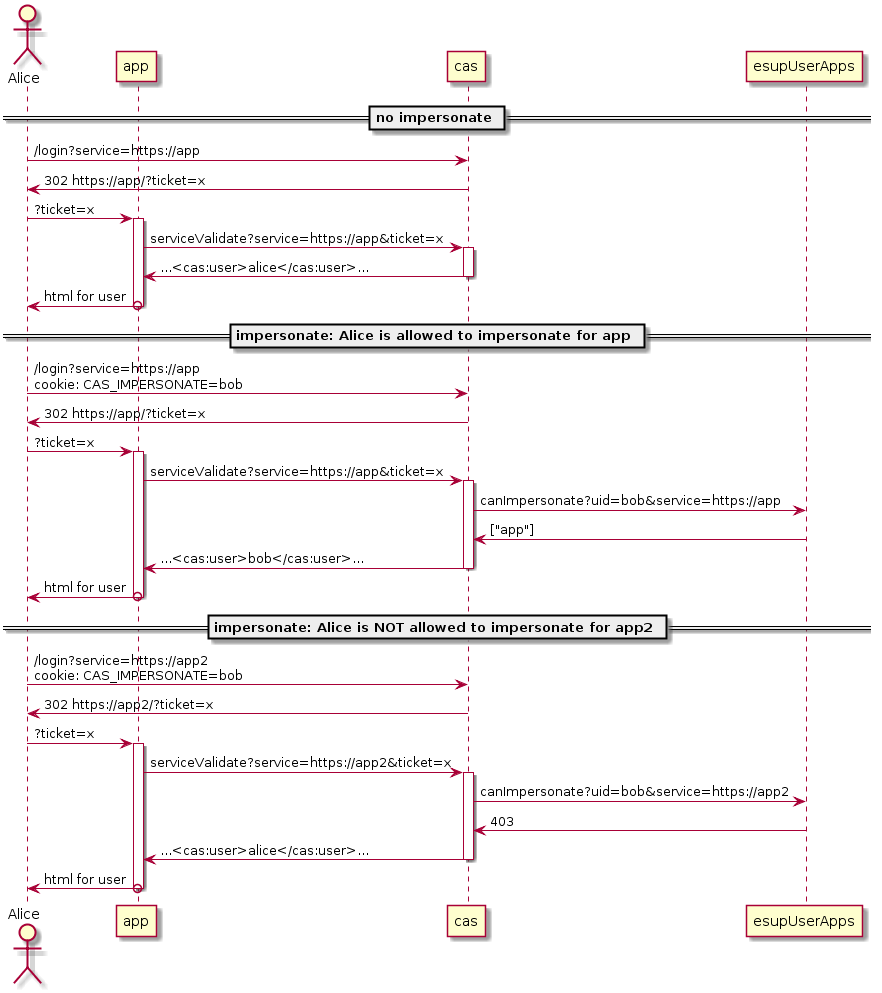

Why
---

Many applications do not allow to transform into another user.


Technical solution
------------------

- a global cookie ``CAS_IMPERSONATE`` is used

- ``/cas/login`` requests with cookie ``CAS_IMPERSONATE`` are proxied: 
  - the proxy will save the ticket + ``CAS_IMPERSONATE`` value

- ``/cas/serviceValidate`` requests with a saved ticket are proxied : 
  - the proxy will check wether the user is allowed to impersonate that service. If allowed its uid is replaced by impersonated uid.



Installation
------------

- you need a web-service implementing ``canImpersonate``
  - known implementations: [EsupUserApps](https://github.com/EsupPortail/EsupUserApps)

- add this at top of apache configuration:

```apache
RewriteEngine On
RewriteCond %{REQUEST_URI} ^/cas/login
RewriteCond %{HTTP_COOKIE} CAS_IMPERSONATE=
RewriteRule .* http://localhost:8081/login [P]

RewriteCond %{REQUEST_URI} ^/cas/serviceValidate$
RewriteCond %{QUERY_STRING} ticket=([^&]+)
RewriteCond /tmp/impersonate-%1 -f
RewriteRule .* http://localhost:8081/serviceValidate [P]
```

- configure CAN_IMPERSONATE_URL in SimpleProxy.java

- run

```sh
ant jetty.run
```

- create an impersonate page which does something like:

```html
<script>
function setCasCookie(uid) {
   document.cookie = "CAS_IMPERSONATE=" + uid + ";domain=.univ-ville.fr;path=/" + (uid ? '' : ";expires=Thu, 01 Jan 1970 00:00:01 GMT;");
}
</script>
<form onsubmit="setCasCookie(this.elements.uid.value); return false;">
  <input name="uid">
</form>
```
